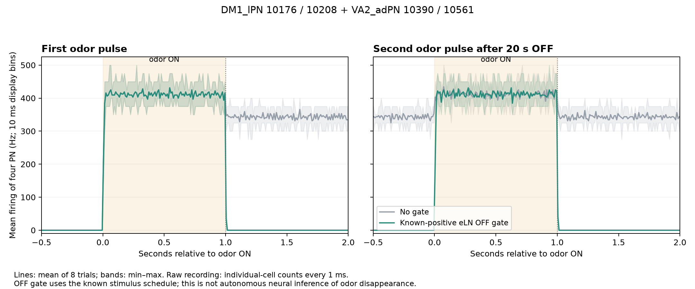

# ハエ・コネクトーム模型における刺激後の残留活動

匂いを切っても投射細胞の平均は高いままに見える。この記録は、DM1とVA2を担当する4細胞だけを見た場合のON／OFF／再ONである。回路全体を直した報告ではない。

匂い刺激を止めたあとも、模型内の神経活動が続くのはなぜか。

[fly-brain-minecraft](https://github.com/blendi-remade/fly-brain-minecraft/tree/6cfa30175003ef25da68a237d5eda958f8047b82) のコネクトーム由来LIF模型を用い、刺激後の活動を支える入力経路と、観測する細胞集団による結果の違いを調べた。刺激の停止期間だけ特定の入力を遮断し、刺激中・停止後・再刺激時の発火を比較した実験ノートである。

## 主な結果

DM1／VA2に対応する4個の投射ニューロン（PN）では、興奮性局所ニューロン（eLN）からの既知正符号入力を刺激停止中だけ遮断すると、**刺激中の応答を保ったまま停止後の発火が0となり、再刺激で応答が回復した**。4乱数seed×2入力利得の8組すべてで確認した。

| 4 PNの平均発火率 | 入力遮断なし | 刺激停止中のみ遮断 |
|---|---:|---:|
| 初回刺激のピーク（50 ms窓） | 410〜455 Hz | 410〜455 Hz |
| 刺激停止後1秒 | 330〜350 Hz | 0 Hz |
| 刺激停止後20秒 | 335〜352.5 Hz | 0 Hz |
| 再刺激のピーク（50 ms窓） | 410〜450 Hz | 410〜450 Hz |
| 再刺激停止後1秒 | 332.5〜352.5 Hz | 0 Hz |

値は8試行の範囲。停止後の3つの観測窓では、平均だけでなく4細胞それぞれが0 Hzだった。時間窓の定義と個別値は [4 PNの時間応答](experiments/brain-four-pn-readout/README.md) に掲載している。



この図はDM1／VA2の4細胞の平均であり、全686 ALPN平均の図ではない。

## 実験の構成

| 実験 | 調べたこと | 結果 |
|---|---|---|
| [入口ORNへの戻り入力](experiments/brain-orn-entry/README.md) | PN／LNから残留10 ORNへの入力を停止 | 9 ORNは静まったが、PNの高活動は続いた |
| [PNへのeLN入力](experiments/brain-pn-output/README.md) | eLNからPNへの正符号入力を停止 | 全PN平均は大幅に低下したが、一部のPNには高い発火が残った |
| [DM1／VA2の4 PNの時間応答](experiments/brain-four-pn-readout/README.md) | 観測集団を固定し、刺激・停止・再刺激を比較 | 刺激中の応答保持、停止後の静穏、再刺激への応答を確認した |

入口と出力への介入は、それぞれ元の回路から独立に実施した。

## 結果の適用範囲

今回の結果は、固定した模型・刺激履歴・細胞集団に対するものである。生体の嗅覚における同経路の役割や、別の匂い・刺激条件での応答は検証していない。

遮断のタイミングには外部の刺激スケジュールを用いた。また、観測対象は4 PNだが、遮断対象は全686 ALPNへの該当入力である。全PN平均には異なる細胞集団の活動が含まれ、4 PNの静穏と全PNの静穏は区別される。

## 使い方

再現時の主な設定は次のとおり。

| 項目 | 設定 |
|---|---|
| 観測細胞 | DM1_lPN `10176`・`10208`、VA2_adPN `10390`・`10561` |
| 遮断する入力 | 全686 ALPNへ入る正符号ALLN入力のうち、伝達物質ラベルがunclear以外の11,069辺 |
| 辺の内訳 | acetylcholine 10,944辺、octopamine 125辺 |
| 遮断時刻 | 刺激停止期間に**到来する**入力。刺激中に到来する入力は通過 |
| 保持する状態 | 膜電位・到来済みシナプス状態。停止時のリセットなし |

「既知正符号」は模型内の符号と伝達物質ラベルによる区分である。各物質の生体での作用をこの実験で検証したものではない。全686 ALPN平均は回路全体の指標として記録し、DM1／VA2の4 PN平均とは別に集計している。

`hungry`／`satiated` は入力利得1.0／0.5の別名であり、空腹・満腹の生理状態を表すものではない。

Java 25、Python 3、NumPyが必要。模型のバージョンとデータSHA256は [upstream.json](upstream.json) に記載している。

```sh
git clone https://github.com/blendi-remade/fly-brain-minecraft.git upstream
git -C upstream checkout --detach 6cfa30175003ef25da68a237d5eda958f8047b82
python3 -m venv .venv
.venv/bin/python -m pip install -r requirements.txt
.venv/bin/python verify.py
```

4 PN実験の一組を実行する。指定した停止条件と、同じseed・入力利得の対照をともに計算する。

```sh
.venv/bin/python experiment.py --seed 2026091701 --gain 1 --gate known_positive \
  --jdk /path/to/jdk-25/bin --out runs/four-pn-seed1-gain1
```

`--jdk` は使用環境のJDK 25の `bin` パスに置き換える。省略時は `JAVA_HOME` またはPATHのJDKを使うため、未導入なら先にJDK 25を用意する。

Python API、引数、出力形式は [API.md](API.md)。他の2実験の実行例は各実験のREADMEに掲載している。

## データと再現性

各実験フォルダには、条件を記した `protocol.json`、対象集団の `cohorts.json`、判定表、結果CSV／JSONを収録している。全ステップの生記録は再実行時に生成され、収録した参照ハッシュと照合される。

| ファイル | 内容 |
|---|---|
| `decision-table.csv` | 試行ごとの評価値・判定 |
| `results/summary.csv`・`report.json` | 集計結果と詳細指標 |
| `byte-copy-manifest.json` | 元の記録とバイト一致を確認した収録ファイル |
| `reference-hashes.json` | 生記録の再現照合用SHA256 |
| `MANIFEST.sha256` | 配布ファイルの整合性確認用SHA256 |

本リポジトリの実行器で代表4試行を再実行し、生記録のハッシュ一致を確認した。4 PNの16試行、および入口・出力の64試行については保存記録から指標を再計算し、元の結果と照合した。検証環境と詳細は [reproduction-check.json](reproduction-check.json) に記載している。

出典とライセンスは [NOTICE.md](NOTICE.md) を参照。
