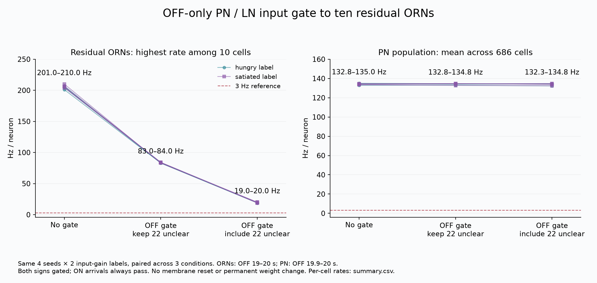

# 入口：残留10 ORNへの戻り入力は必要か

**言えること：固定10 ORNへのPN／LN 116辺をOFF到来だけ止めると、8組すべてで9細胞は静まる。PN平均は132〜135 Hzのままで、対照との差は1%未満だった。**

**言えないこと：全ORNが沈黙した、ORN残留とPN残留は完全に独立した、残留源がAL内部だけにある、この切断で生体の嗅覚を修復した。**

固定10細胞のIDはprotocolに列挙。OFF19〜20秒の個別ORNを主に読み、全686 PNのOFF19.9〜20秒平均を回路全体の診断として比較した。このPN平均を匂いの読み出しへ流用しない。

| OFF停止条件 | 辺数 | 静穏ORN数／10 | 10 ORN平均Hz | 全PN OFF20秒平均Hz |
|---|---:|---:|---:|---:|
| control | 0 | 0 | 74.60〜77.70 | 132.84〜135.01 |
| keep_unclear | 94 | 4〜5 | 25.70〜26.90 | 132.76〜134.75 |
| block_all | 116 | 9 | 1.90〜2.00 | 132.29〜134.81 |

116辺はALPN 18＋ALLN 98。94辺はACh正60＋GABA負34、残り22はunclearの正符号。正と負をともに止める対照であり、正入力除去だけの効果とは読まない。残るORN_DL1 `153948` は19〜20 Hz。全10細胞静穏の参考条件は未達。別経路への追加切断・十分性の試験はしていない。

停止なし8試行は元記録の24.5秒全体と一致し、停止16試行は初回ON終了までの1.5秒が対照と一致した。全24試行の到来判定・ON保存・入力再構成を検証済み。各試行の `*-validation.json` に検査項目を残す。



## 条件と保存

条件の正本は [protocol.json](protocol.json)、対象集団は [cohorts.json](cohorts.json)、判定表は [decision-table.csv](decision-table.csv)。各停止条件は元回路から開始する。

4seed `2026091701, 2026091711, 2026091721, 2026091731` ×入力利得1.0／0.5。DM1／VA2 ORN 157細胞へ60 Hz×利得。無入力0.5秒→ON1秒→OFF20秒→再ON1秒→再OFF2秒。dt=0.5 ms、遅延2 ms、回路gain=0.65、KC gain=0.25、単一worker、50 ms endTick。その他は固定上流LifConfig。

OFFの積分直前に、その到来時刻で停止対象だけを除いた入力へ差し替える。元のfloat加算順を保ち、遅延バッファの非零件数を整合させる。ON末尾発信→OFF到来は止め、OFF末尾発信→再ON到来は通す。膜電位・到来済みシナプス状態のリセットは行わない。

[結果CSV](results/summary.csv)・[指標JSON](results/report.json)は元の測定から保存した値。[コピー同一性](byte-copy-manifest.json)、[省略した生記録の参照ハッシュ](reference-hashes.json)、各試行の検証JSONを併記する。生の全ステップは配布せず、再実行で生成してSHA256を照合する。記録ハッシュ自体は生理的妥当性の証明ではない。

## 再実行

リポジトリ最上位で依存・上流を用意し、未作成の出力先を指定する。

```sh
.venv/bin/python experiment.py --experiment brain-orn-entry \
  --seed 2026091701 --gain 1 --gate block_all \
  --jdk /path/to/jdk-25/bin --out runs/orn-entry-seed1
```

`control / keep_unclear / block_all` の3条件×8組＝24試行。1呼出しで指定1条件を実行し、元の生記録のハッシュを照合する。
