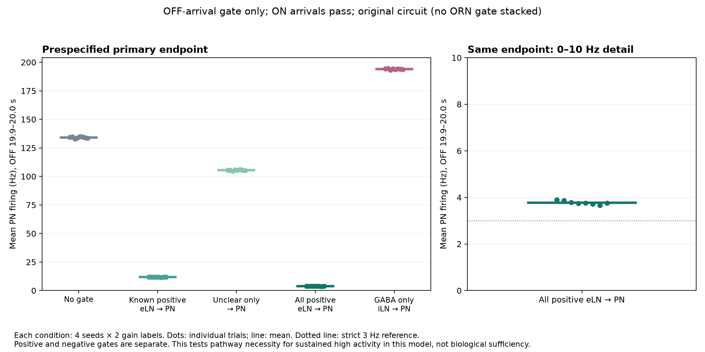

# Output side: auditing arrivals at highly active PNs and blocking eLN output

English | [日本語](README.md)

Inputs arriving at PNs that maintained high activity after odor removal were examined. Blocking positive ALLN→PN inputs only during OFF substantially reduced the mean firing rate across all 686 PNs. Blocking known-positive inputs alone reduced it to approximately 12 Hz; including inputs labeled `unclear` reduced it to approximately 3.7 Hz.

The primary metric is the mean across all 686 ALPNs during 19.9–20 s after stimulus removal. This circuit-wide measure includes populations beyond DM1/VA2.

| OFF blocking condition | Edges | PN OFF20 mean, Hz | Configurations at or below 3 Hz / 8 |
|---|---:|---:|---:|
| control | 0 | 132.84–135.01 | 0 |
| known_positive | 11,069 | 11.69–11.94 | 0 |
| unclear_only | 1,769 | 104.74–106.01 | 0 |
| all_positive | 12,838 | 3.66–3.89 | 0 |
| GABA_only | 6,325 | 193.29–194.50 | 0 |

Even under `all_positive`, 25–27 of the 686 cells continued firing, with maximum individual rates of 300–330 Hz. The lower mean does not indicate silence in all cells. The predefined reference criterion of at most 3 Hz was not met.

Blocking targets ALLN inputs arriving at the preselected set of all ALPNs. `known_positive` means a positive model sign and a neurotransmitter label other than `unclear` (10,944 ACh + 125 octopamine edges). `unclear_only` includes only positive edges labeled `unclear`; `all_positive` is their union. `GABA_only` includes only negative GABA edges. The 1,287 negative glutamate edges always pass through. These categories do not establish biological excitation or fast synaptic action of octopamine.

Arrivals in the eight controls were audited first. Of the positive synaptic increments reaching PNs firing at least 100 Hz during OFF19–20, approximately 81.6% came from eLNs, 14.1% from PNs, and 0.13% from the ten persistent ORNs. The denominator is the sum of positive increments, not membrane potential or a causal share of spikes. Negative inputs were counted separately. The highly active PN set was used for description, not to select the blocking targets. Details are in [audit-report.json](results/audit-report.json).

For all 40 trials, reconstructed inputs were compared with the original buffer at float precision. Zero blocked ON arrivals, boundary behavior, actual emission-to-arrival counts, and individual PN cumulative counts were independently checked. Positive and negative inputs were evaluated separately.



## Scope

Approximately 3.7 Hz is a mean across all 686 PNs, including different cell types, with high firing remaining in some cells. The effects of blocking apply to this model and stimulus condition. Neither the sufficiency of eLN output alone to generate persistent activity nor its role in biological maintenance mechanisms was tested.

## Conditions and data

Experimental conditions are recorded in [protocol.json](protocol.json), populations in [cohorts.json](cohorts.json), and evaluations in [decision-table.csv](decision-table.csv). Each blocking condition starts from the original circuit.

Four seeds (`2026091701, 2026091711, 2026091721, 2026091731`) are combined with input gains of 1.0 and 0.5. The 157 DM1/VA2 ORNs receive 60 Hz × input gain. The sequence is 0.5 s without input → ON for 1 s → OFF for 20 s → re-ON for 1 s → re-OFF for 2 s. Settings are dt = 0.5 ms, delay = 2 ms, circuit gain = 0.65, KC gain = 0.25, one worker, and a 50 ms endTick. Other settings use the pinned upstream LifConfig. The labels `hungry` and `satiated` denote input gains of 1.0 and 0.5, respectively.

Immediately before integration during OFF, the arriving input is replaced with a version that excludes only the selected edges at that arrival time. The original float addition order is preserved, and the delay buffer's nonzero-entry count is kept consistent. Spikes emitted at the end of ON and arriving during OFF are blocked; spikes emitted at the end of OFF and arriving during re-ON pass through. Membrane potential and existing synaptic state are not reset.

The [result CSV](results/summary.csv) and [metrics JSON](results/report.json) retain values from the original measurements. The [byte-copy manifest](byte-copy-manifest.json), [reference hashes for omitted raw records](reference-hashes.json), and per-trial validation JSON files are included. Full timestep records are generated during reruns and checked by SHA256 rather than distributed. Record hashes do not establish physiological validity.

## Reproduction

```sh
.venv/bin/python experiment.py --experiment brain-pn-output \
  --seed 2026091701 --gain 1 --gate all_positive \
  --jdk /path/to/jdk-25/bin --out runs/pn-output-seed1
```

The five conditions in the table × eight configurations give 40 trials. Each call runs one specified condition and checks raw-record hashes against the originals. Input-side ORN blocking is not applied simultaneously.
